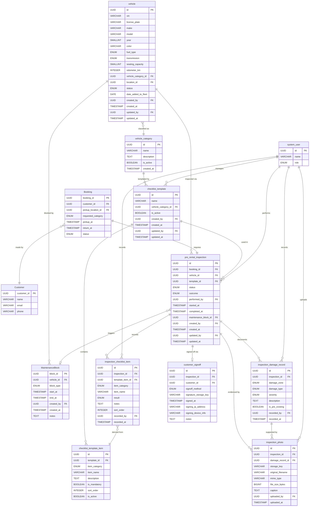

# Technical Requirements Document (TRD)

## Car Rental System — Car Management: Pre-Rental Vehicle Inspection & Preparation

| Field | Details |
|---|---|
| **Document Version** | 1.0 |
| **Date** | 2026-04-01 |
| **Prepared by** | Engineering Team |
| **Business Role** | Car Management Team |
| **Project** | Car Rental System (New Line of Business) |
| **Phase** | Planning & Requirement Analysis |
| **Status** | Draft |
| **PRD Reference** | [prd-car-management.md §4 — Pre-Rental Vehicle Inspection & Preparation](../prd-car-management.md#4-pre-rental-vehicle-inspection--preparation) |

---

## Table of Contents

1. [Overview](#1-overview)
2. [Scope](#2-scope)
3. [Actors & System Boundaries](#3-actors--system-boundaries)
4. [Data Model](#4-data-model)
   - [4.0 Entity Relationship Diagram](#40-entity-relationship-diagram)
5. [Checklist Template Management](#5-checklist-template-management)
6. [Inspection Lifecycle](#6-inspection-lifecycle)
7. [Vehicle Condition Documentation](#7-vehicle-condition-documentation)
8. [Customer Sign-Off](#8-customer-sign-off)
9. [Failed Inspection Handling](#9-failed-inspection-handling)
10. [API Specifications](#10-api-specifications)
11. [Business Rules](#11-business-rules)
12. [Integration Requirements](#12-integration-requirements)
13. [Performance & Non-Functional Requirements](#13-performance--non-functional-requirements)
14. [Security & Audit Requirements](#14-security--audit-requirements)
15. [Error Handling](#15-error-handling)
16. [Open Questions & Assumptions](#16-open-questions--assumptions)
17. [Glossary](#17-glossary)

---

## 1. Overview

This document defines the technical requirements for the **Pre-Rental Vehicle Inspection & Preparation** subsystem within the Car Rental System's Car Management module. It translates the functional requirements in [PRD §4](../prd-car-management.md#4-pre-rental-vehicle-inspection--preparation) into implementable technical specifications covering data models, business logic, APIs, integrations, and non-functional requirements.

The Pre-Rental Inspection subsystem is responsible for:

- Generating a preparation checklist for fleet staff to complete before every vehicle handover.
- Recording structured pass/fail results for each checklist item against the booking record.
- Capturing vehicle condition evidence through a standardised damage diagram and photo uploads.
- Facilitating and storing the customer's digital sign-off on the pre-rental condition record.
- Removing a vehicle from the rental pool immediately and triggering a maintenance request if the pre-rental inspection fails.
- Providing a verifiable condition record linked to every booking, available for dispute resolution.

---

## 2. Scope

### 2.1 In Scope

- Configurable checklist templates defining standard preparation steps per vehicle category.
- Generation of a pre-rental inspection record linked to a booking upon entry into preparation status.
- Staff-completed checklist with pass/fail/not-applicable result per item.
- Structured damage recording using a standardised zone-and-type model.
- Photo upload and storage for visual evidence of vehicle condition.
- Customer digital sign-off, supporting both in-branch (tablet/kiosk) and remote (email/mobile link) capture.
- Automatic vehicle status change and maintenance block creation on inspection failure.
- Automatic booking reassignment trigger upon failed inspection.
- Audit logging for all inspection, damage, and sign-off actions.
- API endpoints consumed by the staff portal, customer portal, and booking engine.

### 2.2 Out of Scope

- Post-rental vehicle return inspection — a separate inspection record model applies; covered by [PRD §7](../prd-car-management.md#7-vehicle-return-operations) and a future TRD.
- Fuel policy definition and fuel-level thresholds — managed by the Fuel Management module; covered by [PRD §9](../prd-car-management.md#9-fuel-management).
- Vehicle maintenance scheduling and work order management — handled by the Maintenance subsystem; this TRD only triggers a maintenance request upon failed inspection.
- Delivery task assignment — covered by [PRD §5.3](../prd-car-management.md#53-delivery-task-assignment); separate TRD required.
- Pricing of damage charges arising from inspection findings — handled by the Accounting module (see `docs/prd-accounting.md`).
- Photo storage infrastructure — assumed to be provided by the platform; this TRD defines only the metadata and reference model.

---

## 3. Actors & System Boundaries

| Actor | Role |
|---|---|
| **Fleet Staff** | Completes the pre-rental checklist and records vehicle condition on behalf of the branch |
| **Fleet Manager** | Configures checklist templates; reviews failed inspection records |
| **Customer** | Reviews the pre-rental condition record and provides digital sign-off |
| **Booking Engine** | Triggers inspection record creation when a booking enters preparation; receives reassignment trigger on inspection failure |
| **Maintenance Subsystem** | Receives and processes the maintenance request generated by a failed inspection |
| **Notification Service** | Delivers customer sign-off requests and inspection-failure alerts |
| **File Storage Service** | Stores inspection photo uploads; provides pre-signed URLs for upload and retrieval |
| **Assignment Engine** | Receives vehicle unavailability event when inspection fails; handles booking reassignment |

---

## 4. Data Model

### 4.0 Entity Relationship Diagram

> **Cross-document note:** The `vehicle`, `vehicle_category`, `Booking`, `Customer`, `system_user`, and `MaintenanceBlock` entities are shared with the [Fleet Size & Growth Planning TRD](./trd-car-management-fleet-size-growth-planning.md) and the [Vehicle Assignment TRD](./trd-car-management-vehicle-assignment.md). Those documents are the canonical definitions for those tables. This TRD introduces the inspection-specific domain entities (`checklist_template`, `checklist_template_item`, `pre_rental_inspection`, `inspection_checklist_item`, `inspection_damage_record`, `inspection_photo`, `customer_signoff`).

### 4.1 `checklist_template`

Defines a reusable preparation checklist linked to a vehicle category (or a global default when `vehicle_category_id` is NULL).

| Column | Type | Constraints | Description |
|---|---|---|---|
| `id` | UUID | PK, not null | Unique template identifier |
| `name` | VARCHAR(200) | not null | Descriptive template name (e.g., "Standard Pre-Rental Checklist — SUV") |
| `vehicle_category_id` | UUID | FK → `vehicle_category.id`, nullable | Category this template applies to; NULL means global default |
| `is_active` | BOOLEAN | not null, default true | Whether this template is available for use in new inspections |
| `created_by` | UUID | FK → `system_user.id`, not null | Fleet manager who created this template |
| `created_at` | TIMESTAMP | not null, default now() | Record creation timestamp (UTC) |
| `updated_by` | UUID | FK → `system_user.id`, nullable | Fleet manager who last updated this template |
| `updated_at` | TIMESTAMP | nullable | Record last updated timestamp (UTC) |

- **Constraint:** Only one active template may exist per `vehicle_category_id` at any time. A single active global default (where `vehicle_category_id` IS NULL) is permitted as a fallback.

### 4.2 `checklist_template_item`

Defines the individual preparation steps within a checklist template.

| Column | Type | Constraints | Description |
|---|---|---|---|
| `id` | UUID | PK, not null | Unique item identifier |
| `template_id` | UUID | FK → `checklist_template.id`, not null | Parent template |
| `item_category` | ENUM | not null | One of: `cleaning`, `fuel_check`, `safety_check`, `damage_inspection`, `documentation` |
| `item_name` | VARCHAR(200) | not null | Short label (e.g., "Interior cleaning", "Tyre pressure check") |
| `description` | TEXT | nullable | Detailed instruction for the staff member |
| `is_mandatory` | BOOLEAN | not null, default true | Whether a fail result on this item causes the overall inspection to fail |
| `sort_order` | INTEGER | not null, default 0 | Display order within the template |
| `is_active` | BOOLEAN | not null, default true | Whether this item is included in new inspections generated from the template |

### 4.3 `pre_rental_inspection`

The primary inspection record for a single booking. One inspection record is created per booking when the vehicle enters preparation status.

| Column | Type | Constraints | Description |
|---|---|---|---|
| `id` | UUID | PK, not null | Unique inspection identifier |
| `booking_id` | UUID | FK → `Booking.booking_id`, unique, not null | Associated booking; one inspection per booking |
| `vehicle_id` | UUID | FK → `vehicle.id`, not null | Vehicle being inspected |
| `template_id` | UUID | FK → `checklist_template.id`, not null | Template used to generate checklist items for this inspection |
| `status` | ENUM | not null, default `pending` | One of: `pending`, `in_progress`, `completed`, `signed_off` |
| `outcome` | ENUM | nullable | One of: `pass`, `fail`; NULL while inspection is in progress |
| `performed_by` | UUID | FK → `system_user.id`, nullable | Fleet staff member who completed the inspection; set when inspection is completed |
| `started_at` | TIMESTAMP | nullable | Timestamp when the first checklist item was recorded |
| `completed_at` | TIMESTAMP | nullable | Timestamp when the inspection was marked completed (pass or fail) |
| `maintenance_block_id` | UUID | FK → `MaintenanceBlock.block_id`, nullable | Populated when `outcome = 'fail'`; references the auto-generated maintenance block |
| `created_by` | UUID | FK → `system_user.id`, not null | User who triggered inspection creation (typically the Booking Engine service account) |
| `created_at` | TIMESTAMP | not null, default now() | Record creation timestamp (UTC) |
| `updated_by` | UUID | FK → `system_user.id`, nullable | User who last updated this record |
| `updated_at` | TIMESTAMP | nullable | Record last updated timestamp (UTC) |

### 4.4 `inspection_checklist_item`

Records the staff-entered result for a single checklist item within an inspection. Items are pre-populated from the checklist template when the inspection record is created.

| Column | Type | Constraints | Description |
|---|---|---|---|
| `id` | UUID | PK, not null | Unique item result identifier |
| `inspection_id` | UUID | FK → `pre_rental_inspection.id`, not null | Parent inspection record |
| `template_item_id` | UUID | FK → `checklist_template_item.id`, nullable | Source template item; NULL for ad-hoc items added by staff at inspection time |
| `item_category` | ENUM | not null | Copied from template item at generation time: `cleaning`, `fuel_check`, `safety_check`, `damage_inspection`, `documentation` |
| `item_name` | VARCHAR(200) | not null | Copied from template item at generation time |
| `result` | ENUM | nullable | One of: `pass`, `fail`, `not_applicable`; NULL until staff records a result |
| `notes` | TEXT | nullable | Optional free-text note from the staff member |
| `sort_order` | INTEGER | not null | Copied from template item |
| `recorded_by` | UUID | FK → `system_user.id`, nullable | Staff member who entered this result |
| `recorded_at` | TIMESTAMP | nullable | Timestamp when the result was recorded |

### 4.5 `inspection_damage_record`

Records a single area of damage found on the vehicle during the pre-rental inspection.

| Column | Type | Constraints | Description |
|---|---|---|---|
| `id` | UUID | PK, not null | Unique damage record identifier |
| `inspection_id` | UUID | FK → `pre_rental_inspection.id`, not null | Parent inspection record |
| `damage_zone` | ENUM | not null | Standardised vehicle zone; one of: `front_bumper`, `hood`, `windshield`, `roof`, `driver_front_door`, `driver_rear_door`, `passenger_front_door`, `passenger_rear_door`, `left_fender`, `right_fender`, `rear_bumper`, `trunk`, `interior_front`, `interior_rear`, `underbody`, `other` |
| `damage_type` | ENUM | not null | One of: `scratch`, `dent`, `crack`, `chip`, `missing_part`, `stain`, `tear`, `other` |
| `severity` | ENUM | not null | One of: `minor`, `moderate`, `major` |
| `description` | TEXT | nullable | Free-text description of the damage |
| `is_pre_existing` | BOOLEAN | not null, default true | Whether this damage pre-dates the current booking |
| `recorded_by` | UUID | FK → `system_user.id`, not null | Staff member who recorded this damage entry |
| `recorded_at` | TIMESTAMP | not null, default now() | Timestamp of damage recording (UTC) |

### 4.6 `inspection_photo`

Stores metadata for a photo uploaded as evidence during a pre-rental inspection. Binary content is held in the platform File Storage Service; this table stores the reference and contextual metadata.

| Column | Type | Constraints | Description |
|---|---|---|---|
| `id` | UUID | PK, not null | Unique photo record identifier |
| `inspection_id` | UUID | FK → `pre_rental_inspection.id`, not null | Parent inspection record |
| `damage_record_id` | UUID | FK → `inspection_damage_record.id`, nullable | Linked damage record if this photo supports a specific damage entry; NULL for general condition photos |
| `storage_key` | VARCHAR(500) | not null | Platform-defined key (path or object ID) used to retrieve the photo from the File Storage Service |
| `original_filename` | VARCHAR(255) | not null | Original filename as uploaded by the staff member |
| `mime_type` | VARCHAR(100) | not null | MIME type of the uploaded file (e.g., `image/jpeg`, `image/png`) |
| `file_size_bytes` | BIGINT | not null, ≥ 1 | File size in bytes |
| `caption` | TEXT | nullable | Optional staff-entered description of the photo |
| `uploaded_by` | UUID | FK → `system_user.id`, not null | Staff member who uploaded the photo |
| `uploaded_at` | TIMESTAMP | not null, default now() | Upload timestamp (UTC) |

### 4.7 `customer_signoff`

Records the customer's digital acceptance of the pre-rental vehicle condition report. One sign-off record per inspection.

| Column | Type | Constraints | Description |
|---|---|---|---|
| `id` | UUID | PK, not null | Unique sign-off record identifier |
| `inspection_id` | UUID | FK → `pre_rental_inspection.id`, unique, not null | Parent inspection; unique constraint enforces one sign-off per inspection |
| `customer_id` | UUID | FK → `Customer.customer_id`, not null | Customer who signed |
| `signoff_method` | ENUM | not null | One of: `in_branch_tablet`, `in_branch_kiosk`, `remote_email`, `remote_mobile` |
| `signature_storage_key` | VARCHAR(500) | not null | Platform key used to retrieve the stored digital signature image or data from the File Storage Service |
| `signed_at` | TIMESTAMP | not null | Timestamp when the customer submitted their signature (UTC) |
| `signing_ip_address` | VARCHAR(45) | nullable | IP address of the signing device; populated for remote sign-off methods |
| `signing_device_info` | VARCHAR(500) | nullable | User-agent or device description; populated for remote sign-off methods |
| `notes` | TEXT | nullable | Optional staff or system-generated note (e.g., "Customer signed remotely via email link") |

---

## 5. Checklist Template Management

### 5.1 Template Applicability Resolution

When generating an inspection record for a booking, the system must resolve the applicable checklist template using the following priority order:

1. The active `checklist_template` whose `vehicle_category_id` matches the assigned vehicle's category.
2. If no category-specific template is active, the active global default template (where `vehicle_category_id IS NULL`).
3. If neither exists, inspection record creation must fail with error `NO_ACTIVE_CHECKLIST_TEMPLATE`.

### 5.2 Template Versioning & Item Snapshotting

- When an inspection is created, the system must copy all active items from the resolved template into `inspection_checklist_item` records. This snapshot ensures the inspection record is not affected by subsequent template modifications.
- The `template_id` on the `pre_rental_inspection` record identifies which template version was used.
- Modifications to a template (adding, removing, or updating items) must not affect inspection records already in progress or completed.

### 5.3 Template Configuration

- Only users with role `fleet_manager` or higher may create, update, or deactivate checklist templates or template items.
- A template may not be deactivated if it is the only active template and no global default exists; the system must reject the deactivation with a descriptive error.
- Deactivating a template must not delete or modify any inspection records that used it.

---

## 6. Inspection Lifecycle

### 6.1 Inspection Creation

- An inspection record must be created automatically when a booking's vehicle assignment transitions to preparation status (i.e., the assigned vehicle is confirmed and the rental start date is approaching within a configurable preparation window).
- The `status` of the new inspection is set to `pending`.
- All active items from the resolved checklist template are copied as `inspection_checklist_item` rows with `result = NULL`.
- A notification must be sent to the responsible fleet staff member at the booking's pickup location via the Notification Service.

### 6.2 In-Progress Inspection

- When the first `inspection_checklist_item` result is recorded, `pre_rental_inspection.status` must transition to `in_progress` and `started_at` must be set.
- Staff must be able to record results for any item in any order; items may be updated before the inspection is completed.
- Staff may add ad-hoc `inspection_checklist_item` records (with `template_item_id = NULL`) for observations not covered by the template.

### 6.3 Inspection Completion

- Staff must explicitly mark the inspection as complete. The system must enforce the following preconditions before accepting completion:
  - All `is_mandatory = true` checklist items (derived from the template) must have a non-NULL `result`.
  - At least one general condition photo must be attached (minimum photo count is configurable; default is 1).

- The system must determine the `outcome` as follows:
  - `pass`: All mandatory items have `result = 'pass'` or `result = 'not_applicable'`.
  - `fail`: One or more mandatory items have `result = 'fail'`.

- Upon completion, `pre_rental_inspection.completed_at` and `performed_by` must be set.

### 6.4 Post-Completion — Pass Path

- If `outcome = 'pass'`:
  - `pre_rental_inspection.status` remains `completed` pending customer sign-off.
  - A sign-off request is sent to the customer via the Notification Service (see [§8](#8-customer-sign-off)).
  - The vehicle remains in `booked` status.

### 6.5 Post-Completion — Fail Path

- If `outcome = 'fail'`, the failed inspection handling process defined in [§9](#9-failed-inspection-handling) must be triggered immediately and atomically.

### 6.6 Signed-Off Inspection

- Once the customer submits a digital signature, `pre_rental_inspection.status` must transition to `signed_off`.
- A `signed_off` inspection record is immutable; no further modifications to checklist items, damage records, or photos are permitted.

---

## 7. Vehicle Condition Documentation

### 7.1 Damage Diagram

- The damage recording model uses a standardised set of `damage_zone` values to represent positions on a vehicle (see [§4.5](#45-inspection_damage_record)).
- The staff portal must render a visual vehicle diagram enabling staff to select a zone by clicking or tapping on the vehicle outline. The zone codes in `inspection_damage_record.damage_zone` are the canonical identifiers for each clickable region.
- Multiple damage records may be created for the same `damage_zone` within a single inspection.

### 7.2 Photo Uploads

- Photo uploads must be handled via a pre-signed URL workflow:
  1. Staff portal calls `POST /inspections/{id}/photos/upload-url` to obtain a pre-signed upload URL from the File Storage Service.
  2. The staff portal uploads the file directly to the File Storage Service using the pre-signed URL.
  3. The staff portal calls `POST /inspections/{id}/photos` to register the `inspection_photo` metadata record.
- Accepted MIME types: `image/jpeg`, `image/png`, `image/webp`.
- Maximum file size per photo: **10 MB** (configurable).
- A minimum of one photo is required to complete the inspection (configurable).

### 7.3 General vs. Damage-Linked Photos

- Photos may be associated with a specific `inspection_damage_record` via `damage_record_id`, or may be general condition photos (`damage_record_id = NULL`).
- When a damage record is deleted before inspection completion, associated photos must be reassigned to `damage_record_id = NULL` (not deleted), so visual evidence is preserved.

---

## 8. Customer Sign-Off

### 8.1 Sign-Off Request Delivery

- After a pre-rental inspection reaches `outcome = 'pass'`, the system must deliver a sign-off request to the customer. The method depends on the rental context:
  - **In-branch**: Staff initiate the sign-off on a tablet or kiosk device; the customer reviews and signs directly.
  - **Remote delivery**: The Notification Service sends the customer an email or mobile link containing a time-limited, single-use URL to the condition report and signature capture page.

### 8.2 Remote Sign-Off Link Validity

- Remote sign-off links must expire after a configurable period (default: **24 hours** from issuance, or at the scheduled rental start time, whichever is earlier).
- Expired links must return an error page directing the customer to contact the branch.
- A new sign-off link may be reissued by authorised staff.

### 8.3 Sign-Off Capture

- The customer must be presented with a read-only summary of the inspection including:
  - All checklist item results.
  - All recorded damage entries with zone, type, severity, and description.
  - All associated photos.
- The customer must provide a digital signature to confirm they have reviewed the condition record.
- Upon submission, a `customer_signoff` record must be created and `pre_rental_inspection.status` must transition to `signed_off`.

### 8.4 Sign-Off Bypass (Staff Override)

- In exceptional circumstances (e.g., customer is physically unable to sign digitally), a `fleet_manager` or higher may record the sign-off on behalf of the customer with a mandatory note in `customer_signoff.notes` explaining the reason.
- All bypass sign-offs must be flagged in the audit log.

---

## 9. Failed Inspection Handling

When `pre_rental_inspection.outcome` is set to `fail`, the system must execute the following steps atomically (within a single database transaction):

### 9.1 Vehicle Status Update

- `vehicle.status` must be updated to `under_maintenance` immediately.
- This status change must be propagated as a `vehicle.status_changed` event on the integration bus so the Assignment Engine and Fleet Dashboard receive the update in real time.

### 9.2 Automatic Maintenance Block Creation

- A `MaintenanceBlock` record must be created with:
  - `vehicle_id`: the failed vehicle
  - `block_type`: `inspection`
  - `start_at`: the current timestamp
  - `end_at`: NULL (open-ended; must be closed by authorised staff when the remediation is complete)
  - `notes`: auto-populated reference to the failed inspection ID (e.g., "Auto-generated from failed pre-rental inspection `{inspection_id}`")
- The `pre_rental_inspection.maintenance_block_id` must be set to the newly created block's ID.

### 9.3 Booking Reassignment Trigger

- The system must emit a `inspection.failed` event on the integration bus with the following payload:

  | Field | Description |
  |---|---|
  | `inspection_id` | Failed inspection record ID |
  | `booking_id` | Affected booking |
  | `vehicle_id` | Failed vehicle |
  | `maintenance_block_id` | Auto-generated maintenance block ID |

- The Booking Engine and Assignment Engine must subscribe to this event and:
  1. Flag the booking as `requires_reassignment`.
  2. Trigger the assignment engine to find a replacement vehicle per the standard assignment logic in [Vehicle Assignment TRD §5](./trd-car-management-vehicle-assignment.md#5-assignment-engine).
  3. If no replacement is found, the customer must be notified and the booking flagged for manual intervention by the Fleet Manager.

### 9.4 Failure Notification

- An alert must be sent via the Notification Service to the Fleet Manager and the booking's branch staff with:
  - Booking reference
  - Vehicle details
  - Failed checklist items
  - Link to the inspection record

---

## 10. API Specifications

All endpoints are internal REST APIs consumed by the Staff Portal, Customer Portal, and Booking Engine. All requests must include a valid authentication token (see [§14.1](#141-authentication--authorisation)).

### 10.1 POST `/inspections`

Trigger creation of a pre-rental inspection record for a booking. Called by the Booking Engine when a booking enters preparation status.

**Request body:**

| Field | Type | Required | Description |
|---|---|---|---|
| `booking_id` | UUID | Yes | Booking for which the inspection is being created |
| `vehicle_id` | UUID | Yes | Assigned vehicle to inspect |

**Response (success — 201 Created):**

| Field | Type | Description |
|---|---|---|
| `inspection_id` | UUID | Newly created inspection record |
| `template_id` | UUID | Checklist template applied |
| `checklist_item_count` | INTEGER | Number of checklist items generated |
| `status` | ENUM | `pending` |

**Response (no active template — 422 Unprocessable Entity):**

| Field | Type | Description |
|---|---|---|
| `code` | STRING | `NO_ACTIVE_CHECKLIST_TEMPLATE` |
| `message` | STRING | Description of the resolution failure |

### 10.2 GET `/inspections/{inspection_id}`

Retrieve a full inspection record including checklist items, damage records, photos, and sign-off status.

**Response (200 OK):** Full `pre_rental_inspection` record with nested `inspection_checklist_item[]`, `inspection_damage_record[]`, `inspection_photo[]`, and `customer_signoff` (if present).

### 10.3 PATCH `/inspections/{inspection_id}/checklist-items/{item_id}`

Record or update a staff result for a single checklist item.

**Request body:**

| Field | Type | Required | Description |
|---|---|---|---|
| `result` | ENUM | Yes | One of: `pass`, `fail`, `not_applicable` |
| `notes` | TEXT | No | Optional free-text note |

**Response (success — 200 OK):** Updated `inspection_checklist_item` record.

**Response (inspection locked — 409 Conflict):** Returned when attempting to update an item on a `signed_off` inspection.

### 10.4 POST `/inspections/{inspection_id}/damage-records`

Add a damage entry to an in-progress inspection.

**Request body:**

| Field | Type | Required | Description |
|---|---|---|---|
| `damage_zone` | ENUM | Yes | Standardised zone code |
| `damage_type` | ENUM | Yes | Damage type code |
| `severity` | ENUM | Yes | One of: `minor`, `moderate`, `major` |
| `description` | TEXT | No | Free-text description |
| `is_pre_existing` | BOOLEAN | Yes | Whether the damage pre-dates this booking |

**Response (success — 201 Created):** Created `inspection_damage_record` record.

### 10.5 DELETE `/inspections/{inspection_id}/damage-records/{record_id}`

Remove a damage record before inspection completion. Associated photos are reassigned to `damage_record_id = NULL`.

**Response (success — 204 No Content).**

**Response (inspection locked — 409 Conflict):** Returned when the inspection has `status = 'signed_off'`.

### 10.6 POST `/inspections/{inspection_id}/photos/upload-url`

Request a pre-signed upload URL for a photo. Staff portal uploads directly to the File Storage Service.

**Request body:**

| Field | Type | Required | Description |
|---|---|---|---|
| `original_filename` | VARCHAR | Yes | Original file name including extension |
| `mime_type` | VARCHAR | Yes | MIME type of the file to be uploaded |
| `file_size_bytes` | BIGINT | Yes | File size in bytes |

**Response (success — 200 OK):**

| Field | Type | Description |
|---|---|---|
| `upload_url` | STRING | Pre-signed URL valid for upload (expires in 15 minutes) |
| `storage_key` | STRING | Key to use when registering the photo metadata record |

### 10.7 POST `/inspections/{inspection_id}/photos`

Register the metadata for an uploaded photo after the upload to the File Storage Service is complete.

**Request body:**

| Field | Type | Required | Description |
|---|---|---|---|
| `storage_key` | VARCHAR | Yes | Storage key returned by the upload-url endpoint |
| `original_filename` | VARCHAR | Yes | Original file name |
| `mime_type` | VARCHAR | Yes | MIME type |
| `file_size_bytes` | BIGINT | Yes | File size in bytes |
| `damage_record_id` | UUID | No | Associated damage record; omit for general photos |
| `caption` | TEXT | No | Optional description |

**Response (success — 201 Created):** Created `inspection_photo` record.

### 10.8 POST `/inspections/{inspection_id}/complete`

Mark the inspection as completed. The system evaluates the outcome (`pass` or `fail`) based on mandatory item results.

**Request body:**

| Field | Type | Required | Description |
|---|---|---|---|
| `performed_by` | UUID | Yes | Staff member completing the inspection |

**Response (success — 200 OK):**

| Field | Type | Description |
|---|---|---|
| `inspection_id` | UUID | Inspection record ID |
| `outcome` | ENUM | `pass` or `fail` |
| `status` | ENUM | `completed` (pass path) |
| `failed_items` | ARRAY | List of failed mandatory item IDs and names (empty if outcome is `pass`) |
| `maintenance_block_id` | UUID | Populated if `outcome = 'fail'` |

**Response (preconditions not met — 422 Unprocessable Entity):**

| Field | Type | Description |
|---|---|---|
| `code` | STRING | `INSPECTION_INCOMPLETE` |
| `unrecorded_mandatory_items` | ARRAY | IDs and names of mandatory items with NULL result |
| `minimum_photos_required` | INTEGER | Configured minimum photo count |
| `photos_attached` | INTEGER | Current photo count |

### 10.9 POST `/inspections/{inspection_id}/signoff`

Record customer digital sign-off on the inspection condition report.

**Request body:**

| Field | Type | Required | Description |
|---|---|---|---|
| `customer_id` | UUID | Yes | Customer providing sign-off |
| `signoff_method` | ENUM | Yes | One of: `in_branch_tablet`, `in_branch_kiosk`, `remote_email`, `remote_mobile` |
| `signature_storage_key` | VARCHAR | Yes | Storage key for the captured signature image/data |
| `signing_ip_address` | VARCHAR | No | Required for remote sign-off methods |
| `signing_device_info` | VARCHAR | No | User-agent string for remote sign-off methods |
| `notes` | TEXT | No | Populated by staff for bypass sign-offs |

**Response (success — 201 Created):** Created `customer_signoff` record; `pre_rental_inspection.status` updated to `signed_off`.

**Response (inspection not in correct state — 409 Conflict):** Returned when the inspection has not yet reached `completed` status with `outcome = 'pass'`.

### 10.10 GET `/inspections/{inspection_id}/signoff-link`

Generate or retrieve a remote sign-off link for the customer. Authorised staff only.

**Response (200 OK):**

| Field | Type | Description |
|---|---|---|
| `sign_off_url` | STRING | Time-limited URL for the customer to access the condition report and sign |
| `expires_at` | ISO 8601 | Expiry timestamp of the link |

### 10.11 Checklist Template Endpoints

| Method | Path | Permission | Description |
|---|---|---|---|
| `GET` | `/checklist-templates` | `fleet:read` | List active checklist templates; filterable by `vehicle_category_id` |
| `POST` | `/checklist-templates` | `fleet:manager` | Create a new checklist template |
| `GET` | `/checklist-templates/{id}` | `fleet:read` | Retrieve a template with its items |
| `PUT` | `/checklist-templates/{id}` | `fleet:manager` | Update template name or status |
| `POST` | `/checklist-templates/{id}/items` | `fleet:manager` | Add an item to a template |
| `PUT` | `/checklist-templates/{id}/items/{item_id}` | `fleet:manager` | Update a template item |
| `DELETE` | `/checklist-templates/{id}/items/{item_id}` | `fleet:manager` | Deactivate a template item |

---

## 11. Business Rules

| Rule ID | Rule | Source |
|---|---|---|
| BR-01 | A pre-rental inspection record must exist and have `status = 'signed_off'` before a vehicle is physically handed over to the customer. | PRD §4.1 |
| BR-02 | Only one active `pre_rental_inspection` record may exist per `booking_id` at any time. | PRD §4.1 |
| BR-03 | All mandatory checklist items must have a recorded result before the inspection can be marked completed. | PRD §4.1 |
| BR-04 | If any mandatory checklist item has `result = 'fail'`, the inspection `outcome` must be `fail`; a passing outcome is not permitted in this case. | PRD §4.4 |
| BR-05 | A failed inspection must immediately set `vehicle.status = 'under_maintenance'` and create a `MaintenanceBlock`; this must occur atomically. | PRD §4.4 |
| BR-06 | The `MaintenanceBlock` auto-generated from a failed inspection must have `end_at = NULL`; it must be closed explicitly by authorised staff after the vehicle is remediated. | PRD §4.4 |
| BR-07 | A booking affected by a failed inspection must be flagged `requires_reassignment`; it must not be automatically cancelled. | PRD §4.4 |
| BR-08 | A `signed_off` inspection record is immutable; no modifications to checklist items, damage records, or photos are permitted after sign-off. | PRD §4.3 |
| BR-09 | Remote sign-off links must expire no later than the scheduled rental start time, regardless of the configured maximum validity period. | PRD §4.3 |
| BR-10 | Customer preference data or identity information must not be stored in the inspection record itself; only the `customer_id` reference is retained. | — |
| BR-11 | A bypass sign-off performed by a `fleet_manager` on behalf of a customer must include a mandatory `notes` value explaining the reason. | PRD §4.3 |
| BR-12 | Only one active `checklist_template` may exist per `vehicle_category_id` (and at most one global default). If a new template is activated for a category, the previous one must be deactivated first. | [§5.3](#53-template-configuration) |
| BR-13 | Checklist item results, damage records, and photos recorded for an inspection apply to B2C and B2B bookings equally. | — |
| BR-14 | All inspection records and associated evidence (photos, signatures) must be retained for a minimum of **7 years** in compliance with the system-wide data retention policy and `docs/prd-accounting.md`. | Accounting PRD |

---

## 12. Integration Requirements

### 12.1 Booking Engine

- The Booking Engine must call `POST /inspections` when a booking's assigned vehicle transitions into preparation status.
- The Booking Engine must subscribe to the `inspection.failed` event on the integration bus to flag the booking as `requires_reassignment` and trigger the reassignment flow.
- The Booking Engine must not update the booking status to `active` until `pre_rental_inspection.status = 'signed_off'`.

### 12.2 Assignment Engine

- The Assignment Engine must subscribe to the `inspection.failed` event and immediately exclude the failed vehicle from the eligible pool for all new assignments.
- The Assignment Engine must treat an `inspection`-type `MaintenanceBlock` identically to a routine maintenance block for eligibility filtering purposes (see [Vehicle Assignment TRD §9](./trd-car-management-vehicle-assignment.md#9-maintenance-blocks)).

### 12.3 Maintenance Subsystem

- The Maintenance Subsystem must receive the `MaintenanceBlock` record created by the failed inspection handling process and open a corresponding maintenance work order.
- When the maintenance work order is resolved, the Maintenance Subsystem must close the `MaintenanceBlock` (set `end_at` to the resolution timestamp) and update `vehicle.status` to `available`.
- Closure of the maintenance block must trigger the waitlist check as defined in [Vehicle Assignment TRD §9.3](./trd-car-management-vehicle-assignment.md#93-maintenance-block-expiry).

### 12.4 Notification Service

The following events must trigger notifications via the Notification Service:

| Event | Recipient | Channel |
|---|---|---|
| Inspection record created | Responsible fleet staff | In-system alert |
| Inspection passed — sign-off required (in-branch) | Fleet staff (to initiate kiosk/tablet sign-off) | In-system alert |
| Inspection passed — sign-off required (remote) | Customer | Email and/or SMS |
| Sign-off link expired without customer action | Fleet staff | In-system alert |
| Inspection failed | Fleet Manager, branch staff | In-system alert, Email |
| Booking reassignment required after failed inspection | Fleet Manager, branch staff | In-system alert |
| Customer sign-off completed | Fleet staff | In-system alert |

### 12.5 File Storage Service

- The File Storage Service must provide a pre-signed URL mechanism for direct client-to-storage photo uploads.
- Pre-signed upload URLs must expire after **15 minutes**.
- The File Storage Service must support retrieval of photos and signature data via `storage_key` for rendering in the staff portal and customer portal.
- Photos and signature data must be stored in a location subject to the 7-year retention policy.

### 12.6 Fleet Dashboard

- The Fleet Dashboard must display the inspection status for each vehicle currently in preparation, refreshed in near-real-time via `inspection.status_changed` events emitted by this subsystem.

---

## 13. Performance & Non-Functional Requirements

### 13.1 Response Time

| Operation | Target (p95) | Maximum (p99) |
|---|---|---|
| Inspection record creation (`POST /inspections`) | ≤ 500 ms | ≤ 2,000 ms |
| Checklist item update (`PATCH /checklist-items/{id}`) | ≤ 300 ms | ≤ 1,000 ms |
| Damage record creation (`POST /damage-records`) | ≤ 300 ms | ≤ 1,000 ms |
| Photo metadata registration (`POST /photos`) | ≤ 300 ms | ≤ 1,000 ms |
| Inspection completion (`POST /complete`) | ≤ 1,000 ms | ≤ 3,000 ms |
| Customer sign-off (`POST /signoff`) | ≤ 500 ms | ≤ 2,000 ms |
| Pre-signed upload URL generation | ≤ 300 ms | ≤ 1,000 ms |

### 13.2 Data Consistency

- The failed inspection transaction (vehicle status update + maintenance block creation + event emission) must execute atomically. Partial failure must roll back all changes and return an appropriate error.
- The inspection completion outcome evaluation must use a consistent read of all `inspection_checklist_item` records to prevent race conditions when multiple staff update items concurrently.

### 13.3 Concurrency

- Concurrent updates to the same `inspection_checklist_item` must use optimistic locking. The last valid write wins; a stale write must return HTTP `409 Conflict`.
- The `POST /complete` endpoint must acquire an advisory lock on the `pre_rental_inspection` record to prevent concurrent completion attempts.

### 13.4 Photo Upload Constraints

- Maximum photo file size: **10 MB** per image (configurable by Fleet Manager).
- Minimum photo count required to complete an inspection: **1** (configurable by Fleet Manager, range 1–10).
- Maximum total photos per inspection: **50** (hard system limit).

### 13.5 Availability

- The Pre-Rental Inspection subsystem must meet the overall system availability SLA (minimum 99.5% uptime during operating hours).
- The subsystem must degrade gracefully if the File Storage Service is temporarily unavailable: inspection completion may proceed without photos only if the minimum photo count is already satisfied from previously uploaded photos.

---

## 14. Security & Audit Requirements

### 14.1 Authentication & Authorisation

- All API endpoints must require a valid JWT bearer token issued by the Identity & Access Management (IAM) service.
- Role-based access control (RBAC) must enforce the following minimum permissions:

  | Endpoint | Minimum role |
  |---|---|
  | `POST /inspections` | `booking_engine_service` (service account) |
  | `GET /inspections/{id}` | `fleet_staff` |
  | `PATCH /checklist-items/{id}` | `fleet_staff` |
  | `POST /damage-records` | `fleet_staff` |
  | `DELETE /damage-records/{id}` | `fleet_staff` |
  | `POST /photos/upload-url` | `fleet_staff` |
  | `POST /photos` | `fleet_staff` |
  | `POST /complete` | `fleet_staff` |
  | `POST /signoff` | `fleet_staff` (in-branch); customer token (remote) |
  | `GET /signoff-link` | `fleet_staff` |
  | Checklist template write operations | `fleet_manager` |
  | Sign-off bypass | `fleet_manager` |

- Remote sign-off links must use a signed, time-limited token that grants single-use access only to the sign-off endpoint for the specific inspection. These tokens must not be reusable.

### 14.2 Audit Logging

- Every state-changing operation on `pre_rental_inspection`, `inspection_checklist_item`, `inspection_damage_record`, `inspection_photo`, `customer_signoff`, and `checklist_template` must generate an immutable audit log entry capturing:
  - Actor (staff ID, customer ID, or service account)
  - Action performed
  - Record ID and entity type
  - Before and after state (as JSON diff)
  - Timestamp (UTC)
- Audit logs must be retained for a minimum of **7 years** in compliance with the system-wide data retention policy.
- Audit log records must not be deletable or modifiable through any application-level API.

### 14.3 Data Protection

- Customer digital signatures stored in the File Storage Service must be encrypted at rest.
- `signing_ip_address` and `signing_device_info` must be treated as personal data and subject to the system's data subject access and erasure policies.
- Photos capturing a customer's personal vehicle or likeness must be treated as personal data where applicable under the relevant data protection regulation.
- Inspection records and evidence must be accessible to the customer via the customer portal for the duration of the rental and for a reasonable period thereafter (specific duration: open question — see OQ-03).

---

## 15. Error Handling

| Scenario | System Behaviour | HTTP Status |
|---|---|---|
| Booking does not exist or is not in a valid state for inspection | Return `INVALID_BOOKING_FOR_INSPECTION` | 400 |
| Inspection already exists for the booking | Return `INSPECTION_ALREADY_EXISTS` | 409 |
| No active checklist template found for the vehicle category | Return `NO_ACTIVE_CHECKLIST_TEMPLATE` | 422 |
| Attempt to record a result on a `signed_off` inspection | Return `INSPECTION_LOCKED` | 409 |
| Completing inspection with unrecorded mandatory items | Return `INSPECTION_INCOMPLETE` with per-item detail | 422 |
| Completing inspection with fewer than the minimum required photos | Return `INSUFFICIENT_PHOTOS` with counts | 422 |
| Customer sign-off submitted against an inspection not yet `completed` | Return `INSPECTION_NOT_READY_FOR_SIGNOFF` | 409 |
| Remote sign-off link expired | Return `SIGNOFF_LINK_EXPIRED` | 410 |
| Remote sign-off link already used | Return `SIGNOFF_LINK_ALREADY_USED` | 409 |
| Failed inspection transaction partially fails (e.g., maintenance block creation error) | Roll back entire transaction; return `INSPECTION_FAIL_PROCESSING_ERROR`; raise alert to Fleet Manager | 500 |
| Photo upload MIME type not permitted | Return `UNSUPPORTED_MEDIA_TYPE` | 415 |
| Photo file size exceeds configured maximum | Return `PHOTO_TOO_LARGE` with configured limit | 422 |
| Maximum photo count per inspection reached | Return `MAX_PHOTOS_REACHED` | 422 |
| Concurrent checklist item update conflict | Return `OPTIMISTIC_LOCK_CONFLICT` | 409 |
| File Storage Service unavailable during upload URL generation | Return `FILE_STORAGE_UNAVAILABLE`; retry guidance in response | 503 |

---

## 16. Open Questions & Assumptions

### Open Questions

| ID | Question | Owner | Status |
|---|---|---|---|
| OQ-01 | What is the configurable preparation window before rental start that triggers automatic inspection record creation? (e.g., 24 hours, 48 hours, or at booking confirmation time) | Car Management Team / Product Owner | Open |
| OQ-02 | What is the minimum and default number of photos required to complete a pre-rental inspection? Is this configurable per vehicle category? | Car Management Team | Open |
| OQ-03 | For how long after rental completion must inspection records and evidence (photos, signatures) remain accessible to the customer via the customer portal? | Product Owner / Legal | Open |
| OQ-04 | Should the digital signature capture support biometric e-signature providers (e.g., DocuSign, Adobe Sign) in addition to freehand canvas signatures? If so, which provider is preferred? | Product Owner / IT | Open |
| OQ-05 | Is the damage zone model (16 standardised zones as defined in §4.5) sufficient for all supported vehicle categories (including Vans and EVs), or are category-specific zone sets required? | Car Management Team | Open |
| OQ-06 | Should fuel level be recorded as a numeric reading (percentage or gauge level) on the checklist, or is a pass/fail against the fuel policy sufficient? If numeric, this TRD will need an additional field on `inspection_checklist_item`. | Car Management Team / Product Owner | Open |
| OQ-07 | Should failed inspection records trigger a customer notification (informing them that their original vehicle has been replaced), or is this handled exclusively by the Booking Engine during reassignment? | Product Owner / Customer Service Team | Open |

### Assumptions

| ID | Assumption |
|---|---|
| A-01 | A single `pre_rental_inspection` record per booking is sufficient; multi-stage or repeat inspections within the same booking are not required at launch. |
| A-02 | The Booking Engine is responsible for all reassignment logic following an `inspection.failed` event; the Inspection subsystem only emits the event and updates vehicle status. |
| A-03 | The File Storage Service is provided by platform infrastructure; this TRD does not specify the underlying object storage technology. |
| A-04 | The digital signature image or data captured during customer sign-off is stored as a binary artefact in the File Storage Service; only the `signature_storage_key` reference is persisted in the database. |
| A-05 | The 16 damage zones defined in §4.5 are sufficient for launch; additional zones may be added via a data migration without requiring schema changes. |
| A-06 | Checklist templates are category-specific at the level of `vehicle_category` (e.g., one template for SUV, one for EV), not at the individual vehicle model level. |
| A-07 | The 7-year audit log and data retention requirement is consistent with the accounting compliance requirement in `docs/prd-accounting.md`. |
| A-08 | Pre-rental inspection applies to both B2C and B2B bookings without distinction. B2B-specific evidence or sign-off requirements, if any, are deferred to a later phase. |

---

## 17. Glossary

| Term | Definition |
|---|---|
| Pre-Rental Inspection | The structured process of preparing and condition-checking a vehicle before it is handed over to a customer for a rental |
| Checklist Template | An administrator-defined set of preparation steps applied to generate the inspection checklist for a booking |
| Inspection Record | The `pre_rental_inspection` entity that captures the full lifecycle and outcome of a single pre-rental inspection |
| Checklist Item | A single preparation or inspection step with a recorded pass/fail/not-applicable result |
| Mandatory Item | A checklist item (derived from the template) where a `fail` result causes the overall inspection to fail |
| Damage Record | A structured entry recording the zone, type, severity, and description of a single area of vehicle damage observed during inspection |
| Damage Zone | A standardised code identifying a region of the vehicle on the damage diagram (e.g., `front_bumper`, `roof`) |
| Customer Sign-Off | The customer's digital acknowledgement that they have reviewed and accepted the pre-rental vehicle condition record |
| Bypass Sign-Off | A sign-off recorded by a `fleet_manager` on behalf of a customer, with mandatory justification, when the customer cannot sign digitally |
| Failed Inspection | An inspection where one or more mandatory checklist items have `result = 'fail'`, resulting in the vehicle being removed from the rental pool |
| Pre-Signed URL | A time-limited, authenticated URL generated by the File Storage Service that authorises a direct client upload without exposing storage credentials |
| Outcome | The final determination of the inspection: `pass` or `fail` |
| RBAC | Role-Based Access Control — access to API operations is governed by the staff member's system role |
| JWT | JSON Web Token — the authentication credential format used by the IAM service |
| OQ | Open Question — a business or technical decision that has not yet been resolved |
| A | Assumption — a documented premise on which this TRD is based |
