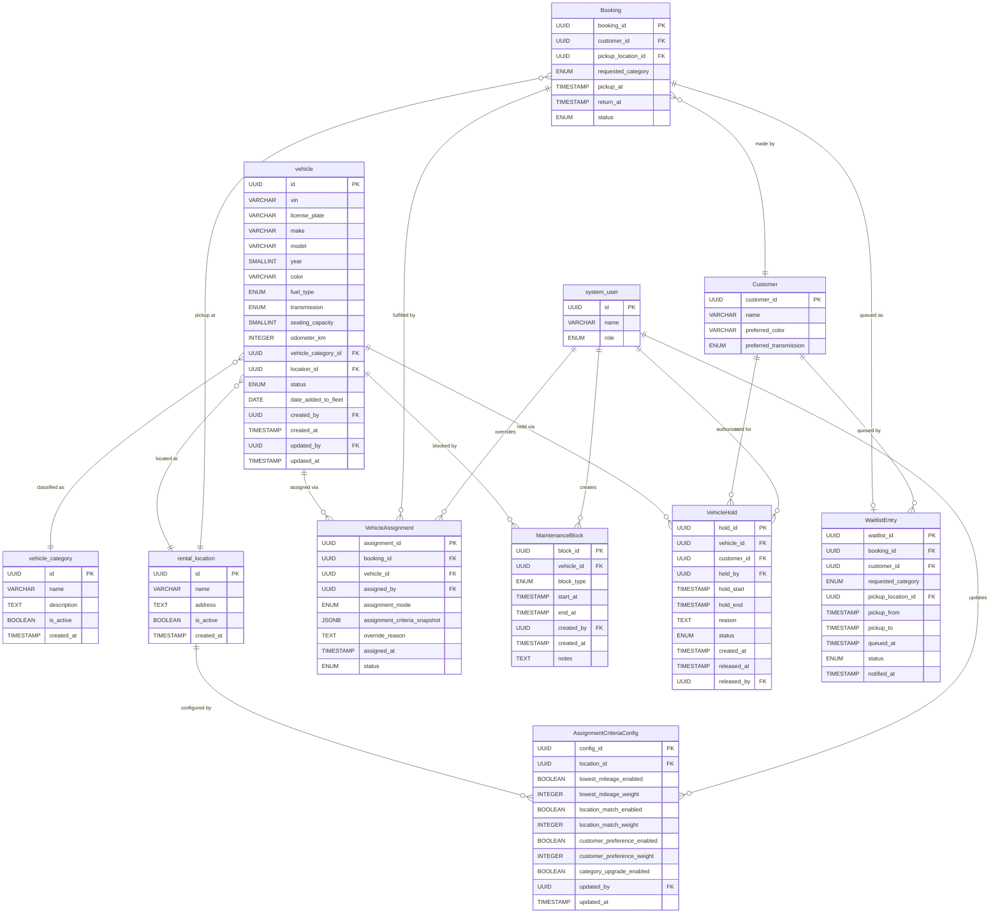

# Technical Requirements Document (TRD)

## Car Rental System — Car Management: Vehicle Assignment

| Field | Details |
|---|---|
| **Document Version** | 1.0 |
| **Date** | 2026-03-31 |
| **Prepared by** | Engineering Team |
| **Business Role** | Car Management Team |
| **Project** | Car Rental System (New Line of Business) |
| **Phase** | Planning & Requirement Analysis |
| **Status** | Draft |
| **PRD Reference** | [prd-car-management.md §3 — Vehicle Availability & Booking Fulfillment](../prd-car-management.md#3-vehicle-availability--booking-fulfillment) |

---

## Table of Contents

1. [Overview](#1-overview)
2. [Scope](#2-scope)
3. [Actors & System Boundaries](#3-actors--system-boundaries)
4. [Data Model](#4-data-model)
   - [4.0 Entity Relationship Diagram](#40-entity-relationship-diagram)
5. [Assignment Engine](#5-assignment-engine)
6. [Automatic Assignment Criteria](#6-automatic-assignment-criteria)
7. [Manual Assignment](#7-manual-assignment)
8. [Unavailability Handling](#8-unavailability-handling)
9. [Maintenance Blocks](#9-maintenance-blocks)
10. [Vehicle Holds & Priority Reservations](#10-vehicle-holds--priority-reservations)
11. [API Specifications](#11-api-specifications)
12. [Business Rules](#12-business-rules)
13. [Integration Requirements](#13-integration-requirements)
14. [Performance & Non-Functional Requirements](#14-performance--non-functional-requirements)
15. [Security & Audit Requirements](#15-security--audit-requirements)
16. [Error Handling](#16-error-handling)
17. [Open Questions & Assumptions](#17-open-questions--assumptions)
18. [Glossary](#18-glossary)

---

## 1. Overview

This document defines the technical requirements for the **Vehicle Assignment** subsystem within the Car Rental System's Car Management module. It translates the functional requirements in [PRD §3.2–§3.6](../prd-car-management.md#32-vehicle-assignment) into implementable technical specifications covering data models, business logic, APIs, integrations, and non-functional requirements.

The Vehicle Assignment subsystem is responsible for:

- Determining the pool of vehicles eligible for assignment to a confirmed booking.
- Executing automatic vehicle selection based on configurable ranking criteria.
- Supporting authorised staff override (manual assignment).
- Handling scenarios where no suitable vehicle is available (upgrade, alternative, waitlist).
- Propagating maintenance blocks to prevent assignment of unavailable vehicles in real-time.
- Managing time-limited holds on specific vehicles for VIP and corporate customers.

---

## 2. Scope

### 2.1 In Scope

- Automatic vehicle assignment engine triggered upon booking confirmation.
- Manual assignment override by authorised staff.
- Configurable automatic assignment criteria (mileage, location, customer preference, category upgrade).
- Unavailability handling: upgrade offer, alternative category offer, and waitlist.
- Real-time maintenance block propagation to the assignment engine.
- Vehicle hold creation, expiry, and management by authorised staff.
- Audit logging for all assignment, hold, and override actions.
- API endpoints consumed by the booking engine, fleet dashboard, and staff portal.

### 2.2 Out of Scope

- Booking creation and pricing — handled by the Booking Engine module.
- Customer-facing booking UI — handled by the Customer Portal module.
- Post-rental vehicle return processing — covered in PRD §7.
- Delivery task assignment — covered in PRD §5.3; separate TRD required.
- GPS hardware integration for real-time location tracking (noted as a future integration point in [§13](#13-integration-requirements)).

---

## 3. Actors & System Boundaries

| Actor | Role |
|---|---|
| **Booking Engine** | Triggers assignment requests when a booking transitions to `confirmed` status |
| **Fleet Staff** | Performs manual assignment overrides via the staff portal |
| **Fleet Manager** | Configures automatic assignment criteria weights and hold authorisation |
| **Maintenance Scheduler** | Creates and updates maintenance blocks that restrict vehicle availability |
| **Notification Service** | Delivers waitlist notifications and hold-expiry alerts |
| **Assignment Engine** | Internal system component; selects the optimal vehicle for a booking |

---

## 4. Data Model

### 4.0 Entity Relationship Diagram



> **Cross-document note:** The `vehicle`, `vehicle_category`, and `rental_location` entities above are shared with the [Fleet Size & Growth Planning TRD](./trd-car-management-fleet-size-growth-planning.md), which is the canonical definition for those tables. The Vehicle Assignment TRD adds the assignment-specific domain entities (`VehicleAssignment`, `MaintenanceBlock`, `VehicleHold`, `WaitlistEntry`, `AssignmentCriteriaConfig`).

### 4.1 Vehicle

The `vehicle` entity is defined canonically in the [Fleet Size & Growth Planning TRD §3.2](./trd-car-management-fleet-size-growth-planning.md#32-vehicle). The fields below are the subset directly relevant to assignment logic.

| Field | Type | Description |
|---|---|---|
| `id` | UUID | Primary key (`vehicle.id` in the fleet TRD) |
| `vin` | VARCHAR(17) | Vehicle Identification Number — unique |
| `vehicle_category_id` | UUID | FK → `vehicle_category.id`; resolved to Economy, Compact, Mid-Size, SUV, Luxury, EV, Van |
| `location_id` | UUID | FK → `rental_location.id`; currently assigned branch |
| `status` | ENUM | `available`, `booked`, `in_transit`, `under_maintenance`, `on_hold`, `retired` |
| `odometer_km` | INTEGER | Current recorded mileage |
| `fuel_type` | ENUM | `petrol`, `diesel`, `hybrid`, `electric` |
| `transmission` | ENUM | `manual`, `automatic` |
| `color` | VARCHAR(50) | Exterior colour |
| `updated_at` | TIMESTAMP | Last status update timestamp |

### 4.2 VehicleAssignment

Records the assignment of a vehicle to a booking, including assignment mode and audit fields.

| Field | Type | Description |
|---|---|---|
| `assignment_id` | UUID | Primary key |
| `booking_id` | UUID | FK → Booking |
| `vehicle_id` | UUID | FK → `vehicle.id` |
| `assigned_by` | UUID | FK → `system_user.id` (NULL if automatic) |
| `assignment_mode` | ENUM | `automatic`, `manual` |
| `assignment_criteria_snapshot` | JSONB | Criteria weights and scores at time of assignment |
| `override_reason` | TEXT | Required when `assignment_mode = manual` and a previous automatic assignment existed |
| `assigned_at` | TIMESTAMP | Timestamp of assignment |
| `status` | ENUM | `active`, `cancelled`, `superseded` |

### 4.3 MaintenanceBlock

Records a time window during which a vehicle must not be assigned to any booking.

| Field | Type | Description |
|---|---|---|
| `block_id` | UUID | Primary key |
| `vehicle_id` | UUID | FK → `vehicle.id` |
| `block_type` | ENUM | `routine`, `inspection`, `ad_hoc` |
| `start_at` | TIMESTAMP | Maintenance window start |
| `end_at` | TIMESTAMP | Maintenance window end (estimated) |
| `created_by` | UUID | FK → `system_user.id` |
| `created_at` | TIMESTAMP | Record creation timestamp |
| `notes` | TEXT | Optional description |

### 4.4 VehicleHold

Records a time-limited hold on a specific vehicle for a named customer or account.

| Field | Type | Description |
|---|---|---|
| `hold_id` | UUID | Primary key |
| `vehicle_id` | UUID | FK → `vehicle.id` |
| `customer_id` | UUID | FK → Customer (B2C or B2B account) |
| `held_by` | UUID | FK → `system_user.id`; authorising staff member |
| `hold_start` | TIMESTAMP | Hold effective from |
| `hold_end` | TIMESTAMP | Hold expires at; must not be NULL |
| `reason` | TEXT | Business justification for the hold |
| `status` | ENUM | `active`, `expired`, `released` |
| `created_at` | TIMESTAMP | Record creation timestamp |
| `released_at` | TIMESTAMP | Timestamp if manually released before expiry |
| `released_by` | UUID | FK → `system_user.id`; NULL if expired automatically |

### 4.5 WaitlistEntry

Records a customer queued for a specific vehicle category when no vehicle is currently available.

| Field | Type | Description |
|---|---|---|
| `waitlist_id` | UUID | Primary key |
| `booking_id` | UUID | FK → Booking |
| `customer_id` | UUID | FK → Customer |
| `requested_category` | ENUM | Vehicle category the customer is waiting for |
| `pickup_location_id` | UUID | FK → `rental_location.id` |
| `pickup_from` | TIMESTAMP | Desired rental start |
| `pickup_to` | TIMESTAMP | Desired rental end |
| `queued_at` | TIMESTAMP | When the waitlist entry was created |
| `status` | ENUM | `waiting`, `notified`, `fulfilled`, `cancelled` |
| `notified_at` | TIMESTAMP | Timestamp when the customer was notified of availability |

### 4.6 AssignmentCriteriaConfig

Stores the active configuration for automatic assignment criteria per location (or globally if `location_id` is NULL).

| Field | Type | Description |
|---|---|---|
| `config_id` | UUID | Primary key |
| `location_id` | UUID | FK → `rental_location.id`; NULL means global default |
| `lowest_mileage_enabled` | BOOLEAN | Whether lowest-mileage criterion is active |
| `lowest_mileage_weight` | INTEGER | Relative weight (1–100) |
| `location_match_enabled` | BOOLEAN | Whether location-match criterion is active |
| `location_match_weight` | INTEGER | Relative weight (1–100) |
| `customer_preference_enabled` | BOOLEAN | Whether customer preference matching is active |
| `customer_preference_weight` | INTEGER | Relative weight (1–100) |
| `category_upgrade_enabled` | BOOLEAN | Whether auto-upgrade is permitted when requested category is unavailable |
| `updated_by` | UUID | FK → `system_user.id` |
| `updated_at` | TIMESTAMP | Last configuration change |

---

## 5. Assignment Engine

### 5.1 Assignment Trigger

- The Assignment Engine must be invoked **synchronously** when a booking transitions to `confirmed` status.
- The Assignment Engine must also be invokable on demand by staff via the manual assignment interface.
- The engine must complete and return a result within the latency threshold defined in [§14.1](#141-response-time).

### 5.2 Eligibility Filter

Before scoring, the engine must filter the vehicle pool to those meeting **all** of the following conditions:

| Condition | Logic |
|---|---|
| Category match | `vehicle.category = booking.requested_category` (upgrades handled separately in §8) |
| Location match | `vehicle.location_id = booking.pickup_location_id` |
| Status available | `vehicle.status = 'available'` |
| No active maintenance block | No `MaintenanceBlock` with `start_at ≤ booking.pickup_at AND end_at ≥ booking.pickup_at` |
| No active hold | No `VehicleHold` with `status = 'active'` AND `hold_start ≤ booking.pickup_at AND hold_end ≥ booking.pickup_at` AND `customer_id ≠ booking.customer_id` |
| Not in transit | `vehicle.status ≠ 'in_transit'` |
| Not retired | `vehicle.status ≠ 'retired'` |

### 5.3 Scoring & Ranking

After filtering, each eligible vehicle is scored using the active `AssignmentCriteriaConfig`. The score is a weighted sum:

```
score(v) = Σ ( criterion_weight(c) × normalised_criterion_score(v, c) )
```

The vehicle with the **highest score** is selected. In the event of a tie, the vehicle with the lowest `odometer_km` is preferred as a tiebreaker.

The criteria scoring functions are defined in [§6](#6-automatic-assignment-criteria).

### 5.4 Assignment Record Creation

Upon selecting a vehicle, the engine must:

1. Create a `VehicleAssignment` record with `assignment_mode = 'automatic'` and a snapshot of the criteria weights and individual scores in `assignment_criteria_snapshot`.
2. Update `vehicle.status` to `'booked'`.
3. Emit an `assignment.created` event to the integration bus for consumption by the Booking Engine, Notification Service, and Fleet Dashboard.

### 5.5 No Eligible Vehicle Found

If no eligible vehicle passes the eligibility filter, the engine must invoke the Unavailability Handling process defined in [§8](#8-unavailability-handling).

---

## 6. Automatic Assignment Criteria

The following criteria must be supported. Each criterion is independently enable/disable-able and carries a configurable weight (1–100). Only enabled criteria participate in scoring. All scores are normalised to a 0–1 range before weighting.

### 6.1 Lowest Mileage

- **Purpose**: Prefer vehicles with the lowest odometer reading to distribute wear evenly across the fleet.
- **Score function**: `score = 1 − (vehicle.odometer_km / max_odometer_in_eligible_pool)`.
- **Edge case**: If all eligible vehicles have identical odometer readings, all receive score 1.0.

### 6.2 Location Match

- **Purpose**: Prefer vehicles physically located at or closest to the pickup location.
- **Score function**: Binary — `1.0` if `vehicle.location_id = booking.pickup_location_id`; `0.0` otherwise.
- **Note**: The eligibility filter (§5.2) already restricts to `location_id = pickup_location_id` for standard assignments. This criterion is retained as a configurable weight to allow future extension to nearest-branch assignment (open question OQ-04).

### 6.3 Customer Preference

- **Purpose**: Match documented customer preferences (color, transmission type).
- **Score function**: Additive match across active preference sub-criteria:
  - Color match: +0.5 if `vehicle.color = customer.preferred_color`
  - Transmission match: +0.5 if `vehicle.transmission = customer.preferred_transmission`
  - Total normalised to 0–1.
- **Data source**: Customer preference data stored in the Customer Profile service.
- **Note**: If no customer preferences are recorded, this criterion scores 0.0 for all vehicles and does not affect ranking.

### 6.4 Category Upgrade (Auto-Upgrade Fallback)

- **Purpose**: Permit assignment of a higher category vehicle only when the requested category is fully unavailable.
- **Activation condition**: This criterion is only applied after the eligibility filter returns zero results for the requested category (see [§8.1](#81-upgrade-offer)).
- **Score function**: `score = 1.0` for the nearest higher category; descending score for each category tier above that.
- **Configuration**: `category_upgrade_enabled` must be `true` in `AssignmentCriteriaConfig`; additional charge applicability is governed by pricing configuration outside this TRD.

---

## 7. Manual Assignment

### 7.1 Staff Override

- Authorised staff (role: `fleet_staff` or `fleet_manager`) must be able to select any vehicle from the available pool for a specific booking, overriding the automatic assignment result.
- The manual assignment interface must display the full eligible vehicle list, sorted by automatic assignment score descending, with individual criterion scores visible.
- Staff must provide a free-text `override_reason` when replacing an existing automatic assignment. This field is mandatory for audit compliance.

### 7.2 Unrestricted Override Pool

- In manual assignment mode, staff may also select a vehicle that did not pass the automatic eligibility filter, subject to a confirmation warning.
- Vehicles with `status = 'retired'` must not be selectable under any circumstance.
- A confirmation dialog must be displayed for any vehicle with an active maintenance block or hold.

### 7.3 Manual Assignment Record

- A `VehicleAssignment` record must be created with `assignment_mode = 'manual'`.
- If a prior automatic assignment exists for the same booking, its status must be updated to `'superseded'` before the manual record is created.
- All manual assignments must be captured in the audit log with the staff member's identity and timestamp.

---

## 8. Unavailability Handling

When the eligibility filter (§5.2) yields no results for the requested vehicle category, the system must execute the following steps in order.

### 8.1 Upgrade Offer

- If `category_upgrade_enabled = true` in the active `AssignmentCriteriaConfig`, the system must identify the next available higher-category vehicle.
- Category hierarchy (ascending): Economy → Compact → Mid-Size → SUV → Luxury.
- EVs and Vans do not participate in the standard upgrade hierarchy; upgrade between these categories must not be offered automatically.
- The upgrade offer must be presented to the customer (via the customer portal or by staff) with the following information:

  | Field | Description |
  |---|---|
  | Original category | Customer's requested vehicle category |
  | Upgrade category | Proposed higher-category vehicle |
  | Additional charge | Amount (if any) per the configured pricing; may be zero |
  | Acceptance deadline | Time by which the customer must accept the offer |

- If the customer accepts, the upgrade vehicle is assigned and a `VehicleAssignment` record is created with `assignment_mode = 'automatic'` and a note indicating upgrade.
- If the customer declines or does not respond within the acceptance deadline, the system proceeds to §8.2.

### 8.2 Alternative Category Offer

- Staff may offer an alternative category at equivalent pricing (not necessarily a higher tier).
- This is a manual staff action; no automatic selection applies.
- If accepted by the customer, the assignment is recorded as `assignment_mode = 'manual'` with a note indicating alternative-category offer.

### 8.3 Waitlist

- If neither upgrade nor alternative is accepted, the system must allow staff to place the customer on the `WaitlistEntry` queue for the original requested category.
- A `WaitlistEntry` record must be created with `status = 'waiting'`.
- When a vehicle of the requested category becomes available for the required window, the system must:
  1. Identify matching waitlist entries ordered by `queued_at` (earliest first).
  2. Notify the customer via the Notification Service (channel: email and/or SMS, per customer preference).
  3. Update `WaitlistEntry.status` to `'notified'` and set `notified_at`.
  4. Hold the vehicle for a configurable acceptance window (see OQ-01).
- If the customer accepts the waitlisted vehicle within the acceptance window, the assignment proceeds normally and `WaitlistEntry.status` is set to `'fulfilled'`.
- If the customer does not respond within the acceptance window, the vehicle is released and the next waitlist entry is processed.

---

## 9. Maintenance Blocks

### 9.1 Block Creation & Propagation

- A `MaintenanceBlock` record must be created by the Maintenance Scheduling subsystem and must be immediately visible to the Assignment Engine without requiring a manual refresh.
- The Assignment Engine must query active maintenance blocks at the time of each eligibility filter evaluation; it must not use a cached copy older than the staleness threshold defined in [§14.2](#142-data-freshness).
- The `MaintenanceBlock` must set `vehicle.status = 'under_maintenance'` for the duration of the block window.

### 9.2 Booking Conflict Detection

- When a new `MaintenanceBlock` is created for a vehicle that already has an active `VehicleAssignment` overlapping the maintenance window:
  1. The system must detect the conflict automatically.
  2. A conflict alert must be raised to the Fleet Manager and relevant branch staff (see [§13.3](#133-notification-service)).
  3. The existing booking must be flagged as `requires_reassignment`; it must not be automatically cancelled.
  4. Staff must manually reassign the booking or reschedule the maintenance window; the system must not resolve the conflict automatically.

### 9.3 Maintenance Block Expiry

- When a `MaintenanceBlock.end_at` is reached and the associated maintenance job is marked complete, `vehicle.status` must revert to `'available'` automatically.
- If the maintenance job is not completed by `end_at`, the block must remain active until explicitly closed by authorised staff; `vehicle.status` must not revert automatically in this case.
- Upon block expiry or closure, the system must check for matching waitlist entries (§8.3) and trigger notifications as appropriate.

---

## 10. Vehicle Holds & Priority Reservations

### 10.1 Hold Creation

- A `VehicleHold` may only be created by staff with role `fleet_manager` or higher.
- `hold_end` must be explicitly set and must not be a null value; open-ended holds are not permitted.
- Upon hold creation, `vehicle.status` must be updated to `'on_hold'`.
- A hold creation event must be emitted to the audit log and the integration bus.

### 10.2 Hold Enforcement in Assignment

- A vehicle with `status = 'on_hold'` must be excluded from the automatic eligibility filter for all bookings where `booking.customer_id ≠ VehicleHold.customer_id`.
- A vehicle on hold for a specific customer must appear as eligible only for that customer's bookings during the hold period.

### 10.3 Hold Expiry

- The system must run a scheduled job (minimum frequency: every 5 minutes) to detect `VehicleHold` records where `hold_end ≤ current_time` and `status = 'active'`.
- Expired holds must be updated to `status = 'expired'` and `vehicle.status` must revert to `'available'` (provided no other block or assignment is active).
- A hold-expiry notification must be sent to the staff member who created the hold.

### 10.4 Manual Hold Release

- Authorised staff (`fleet_manager` or higher) may release an active hold before its `hold_end` time.
- Upon manual release, `released_at` and `released_by` must be recorded on the `VehicleHold` record.
- Vehicle status must revert to `'available'` and the waitlist check (§8.3) must be triggered.

---

## 11. API Specifications

All endpoints are internal REST APIs consumed by the Booking Engine, Staff Portal, and Fleet Dashboard. All requests must include a valid authentication token (see [§15.1](#151-authentication--authorisation)).

### 11.1 POST `/assignments`

Trigger automatic vehicle assignment for a confirmed booking.

**Request body:**

| Field | Type | Required | Description |
|---|---|---|---|
| `booking_id` | UUID | Yes | The booking to assign a vehicle to |
| `requested_category` | ENUM | Yes | Vehicle category requested in the booking |
| `pickup_location_id` | UUID | Yes | Pickup location |
| `pickup_at` | ISO 8601 | Yes | Rental start datetime |
| `return_at` | ISO 8601 | Yes | Rental end datetime |
| `customer_id` | UUID | Yes | Customer identifier for preference matching and hold checks |

**Response (success — 201 Created):**

| Field | Type | Description |
|---|---|---|
| `assignment_id` | UUID | Newly created assignment record |
| `vehicle_id` | UUID | Assigned vehicle |
| `assignment_mode` | ENUM | `automatic` |
| `assigned_at` | ISO 8601 | Timestamp |

**Response (no vehicle available — 422 Unprocessable Entity):**

| Field | Type | Description |
|---|---|---|
| `code` | STRING | `NO_VEHICLE_AVAILABLE` |
| `upgrade_available` | BOOLEAN | Whether an upgrade-category vehicle exists |
| `upgrade_category` | ENUM | Upgrade category if available; null otherwise |
| `waitlist_eligible` | BOOLEAN | Always `true` when no vehicle is available |

### 11.2 PUT `/assignments/{assignment_id}`

Perform a manual assignment override.

**Request body:**

| Field | Type | Required | Description |
|---|---|---|---|
| `vehicle_id` | UUID | Yes | The vehicle selected by staff |
| `override_reason` | TEXT | Yes | Mandatory justification for the override |
| `staff_id` | UUID | Yes | Authorising staff member |

**Response (success — 200 OK):** Returns the updated `VehicleAssignment` record.

### 11.3 GET `/assignments/eligible-vehicles`

Return the eligible vehicle pool for a prospective booking (used by the manual assignment UI).

**Query parameters:** `booking_id`, `include_ineligible` (boolean, default false).

**Response (200 OK):** Paginated list of vehicles with assignment score breakdown per criterion.

### 11.4 POST `/holds`

Create a vehicle hold.

**Request body:**

| Field | Type | Required | Description |
|---|---|---|---|
| `vehicle_id` | UUID | Yes | Vehicle to hold |
| `customer_id` | UUID | Yes | Customer or account for whom the hold is placed |
| `hold_start` | ISO 8601 | Yes | Hold start datetime |
| `hold_end` | ISO 8601 | Yes | Hold expiry datetime |
| `reason` | TEXT | Yes | Business justification |
| `staff_id` | UUID | Yes | Authorising staff member |

**Response (success — 201 Created):** Returns the created `VehicleHold` record.

**Response (vehicle not available — 409 Conflict):** Returns `VEHICLE_NOT_AVAILABLE` with current blocking reason.

### 11.5 DELETE `/holds/{hold_id}`

Release an active hold before its scheduled expiry.

**Request body:**

| Field | Type | Required | Description |
|---|---|---|---|
| `staff_id` | UUID | Yes | Releasing staff member |

**Response (success — 200 OK):** Returns the updated `VehicleHold` record with `status = 'released'`.

### 11.6 POST `/waitlist`

Add a customer to the waitlist for a vehicle category.

**Request body:**

| Field | Type | Required | Description |
|---|---|---|---|
| `booking_id` | UUID | Yes | Associated booking |
| `customer_id` | UUID | Yes | Customer |
| `requested_category` | ENUM | Yes | Desired vehicle category |
| `pickup_location_id` | UUID | Yes | Pickup location |
| `pickup_from` | ISO 8601 | Yes | Rental start |
| `pickup_to` | ISO 8601 | Yes | Rental end |

**Response (success — 201 Created):** Returns the `WaitlistEntry` record including queue position.

---

## 12. Business Rules

| Rule ID | Rule | Source |
|---|---|---|
| BR-01 | A vehicle with `status ≠ 'available'` must not be automatically assigned to any booking. | PRD §3.1 |
| BR-02 | Automatic assignment must complete within the response-time SLA defined in §14.1 before returning a result to the caller. | PRD §3.2 |
| BR-03 | A manual assignment override always supersedes a prior automatic assignment for the same booking. | PRD §3.2 |
| BR-04 | An override reason is mandatory for all manual assignments that replace an existing automatic assignment. | PRD §3.2 |
| BR-05 | Category upgrade may only be offered when `category_upgrade_enabled = true`; it must never be applied silently without customer or staff confirmation. | PRD §3.4 |
| BR-06 | Automatic upgrade must follow the defined category hierarchy; no lateral or downward substitution is permitted automatically. | PRD §3.4 |
| BR-07 | A maintenance block must exclude the blocked vehicle from all new assignments covering any part of the block window. | PRD §3.5 |
| BR-08 | A booking conflict caused by a new maintenance block must raise an alert but must not auto-cancel the affected booking. | PRD §3.5 |
| BR-09 | A vehicle hold may only be created by a `fleet_manager` or higher role. | PRD §3.6 |
| BR-10 | A vehicle hold must always have an explicit `hold_end`; open-ended holds are prohibited. | PRD §3.6 |
| BR-11 | A held vehicle is excluded from all automatic assignments except for the specific customer for whom the hold was created. | PRD §3.6 |
| BR-12 | Waitlist notifications must be processed in FIFO order by `queued_at`. | PRD §3.4 |
| BR-13 | A vehicle with `status = 'retired'` must not be selectable in either automatic or manual assignment. | PRD §2.3 |

---

## 13. Integration Requirements

### 13.1 Booking Engine

- The Booking Engine must call `POST /assignments` immediately after a booking transitions to `confirmed` status.
- The Booking Engine must expose a webhook or event subscription endpoint to receive `assignment.created`, `assignment.superseded`, and `assignment.failed` events.
- Booking status must not be shown as `fully confirmed` to the customer until a successful assignment response is received or a waitlist entry is created.

### 13.2 Maintenance Scheduling Subsystem

- The Maintenance Scheduling subsystem must publish a `maintenance_block.created` event on the integration bus whenever a new `MaintenanceBlock` is created or updated.
- The Assignment Engine must subscribe to this event and update its in-memory or cached vehicle availability state within the staleness threshold in [§14.2](#142-data-freshness).
- The event payload must include: `vehicle_id`, `block_id`, `start_at`, `end_at`.

### 13.3 Notification Service

The following events must trigger notifications via the Notification Service:

| Event | Recipient | Channel |
|---|---|---|
| Upgrade offer generated | Customer | Email / SMS / in-app |
| Waitlist position confirmed | Customer | Email / SMS |
| Waitlist vehicle available | Customer | Email / SMS |
| Maintenance booking conflict detected | Fleet Manager, Branch Staff | In-system alert, Email |
| Hold expiry approaching (configurable advance notice) | Creating staff member | In-system alert |
| Hold expired | Creating staff member | In-system alert |

### 13.4 Fleet Dashboard

- The Fleet Dashboard must subscribe to `vehicle.status_changed` events to display real-time vehicle status without polling.
- The Assignment Engine must emit `vehicle.status_changed` whenever a vehicle's `status` field is updated.

### 13.5 Customer Profile Service

- The Assignment Engine must query the Customer Profile Service for customer preferences (color, transmission) when `customer_preference_enabled = true`.
- If the Customer Profile Service is unavailable, the engine must degrade gracefully by setting the customer preference score to 0.0 for all vehicles and proceeding with other active criteria.

---

## 14. Performance & Non-Functional Requirements

### 14.1 Response Time

| Operation | Target (p95) | Maximum (p99) |
|---|---|---|
| Automatic assignment (`POST /assignments`) | ≤ 500 ms | ≤ 2,000 ms |
| Manual eligible vehicle list (`GET /assignments/eligible-vehicles`) | ≤ 300 ms | ≤ 1,000 ms |
| Hold creation (`POST /holds`) | ≤ 300 ms | ≤ 1,000 ms |
| Waitlist entry creation (`POST /waitlist`) | ≤ 300 ms | ≤ 1,000 ms |

### 14.2 Data Freshness

- Vehicle availability data used by the Assignment Engine must be no older than **5 minutes** as per [PRD §3.1](../prd-car-management.md#31-real-time-availability).
- Maintenance block data must be propagated to the Assignment Engine within **60 seconds** of creation.
- Hold status changes must be reflected in the eligibility filter within **30 seconds**.

### 14.3 Concurrency

- The Assignment Engine must use optimistic locking or equivalent concurrency control to prevent two concurrent requests from assigning the same vehicle to different bookings.
- Under concurrent booking load, the system must guarantee that a given vehicle is assigned to at most one active booking at any point in time.

### 14.4 Scalability

- The Assignment Engine must be stateless and horizontally scalable.
- Database queries for eligibility filtering must be index-optimised for `vehicle.status`, `vehicle.category`, `vehicle.location_id`, `maintenance_block.start_at/end_at`, and `vehicle_hold.hold_start/hold_end`.

### 14.5 Availability

- The Assignment Engine must meet the overall system availability SLA (to be defined in the system-level non-functional requirements document; minimum 99.5% uptime during operating hours).

---

## 15. Security & Audit Requirements

### 15.1 Authentication & Authorisation

- All API endpoints must require a valid JWT bearer token issued by the Identity & Access Management (IAM) service.
- Role-based access control (RBAC) must enforce the following minimum permissions:

  | Endpoint | Minimum role |
  |---|---|
  | `POST /assignments` | `booking_engine_service` (service account) |
  | `PUT /assignments/{id}` | `fleet_staff` |
  | `GET /assignments/eligible-vehicles` | `fleet_staff` |
  | `POST /holds` | `fleet_manager` |
  | `DELETE /holds/{id}` | `fleet_manager` |
  | `POST /waitlist` | `fleet_staff` |
  | `GET /waitlist` | `fleet_staff` |
  | `AssignmentCriteriaConfig` write operations | `fleet_manager` |

### 15.2 Audit Logging

- Every state-changing operation on `VehicleAssignment`, `VehicleHold`, `WaitlistEntry`, and `AssignmentCriteriaConfig` must generate an immutable audit log entry capturing:
  - Actor (staff ID or service account)
  - Action performed
  - Record ID and entity type
  - Before and after state (as JSON diff)
  - Timestamp
- Audit logs must be retained for a minimum of **7 years** in compliance with the system-wide data retention policy.
- Audit log records must not be deletable or modifiable through any application-level API.

### 15.3 Data Protection

- Customer preference data retrieved from the Customer Profile Service must not be persisted in the `assignment_criteria_snapshot`; only the computed scores must be stored.
- Personal data (customer ID, customer name) stored in `VehicleHold` and `WaitlistEntry` must be subject to the system's data subject access and erasure policies.

---

## 16. Error Handling

| Scenario | System Behaviour | HTTP Status |
|---|---|---|
| No eligible vehicle found | Return `NO_VEHICLE_AVAILABLE` with upgrade and waitlist options | 422 |
| Requested vehicle already assigned | Return `VEHICLE_ALREADY_ASSIGNED` | 409 |
| Booking not in `confirmed` status | Reject assignment request with `INVALID_BOOKING_STATUS` | 400 |
| Vehicle `status = 'retired'` selected | Reject with `VEHICLE_RETIRED` | 400 |
| Hold `hold_end` is in the past | Reject hold creation with `INVALID_HOLD_PERIOD` | 400 |
| Concurrent assignment conflict (optimistic lock failure) | Retry assignment up to 3 times; return `ASSIGNMENT_CONFLICT` if retries exhausted | 409 |
| Customer Profile Service unavailable | Degrade gracefully: set customer preference score to 0.0, log warning, proceed | N/A (internal) |
| Maintenance Scheduling event missed | Assignment Engine falls back to database query for maintenance blocks on each request | N/A (internal) |

---

## 17. Open Questions & Assumptions

### Open Questions

| ID | Question | Owner | Status |
|---|---|---|---|
| OQ-01 | What is the configurable acceptance window for a waitlisted customer to respond before the vehicle is released to the next entry? | Product Owner | Open |
| OQ-02 | Should upgrade offers carry a specific expiry timer visible to the customer, and if so, what is the default duration? | Product Owner | Open |
| OQ-03 | Is cross-location assignment (assigning a vehicle from a nearby branch) in scope for launch, or is it deferred? This affects the Location Match criterion and eligibility filter. | Product Owner / Car Management Team | Open |
| OQ-04 | What is the maximum number of waitlist entries per category per location before the system raises a demand-shortage alert to the Fleet Manager? | Car Management Team | Open |
| OQ-05 | For corporate/B2B accounts, can a hold be placed at account level (covering any booking by the account) rather than against a specific customer? | Product Owner / Accounting Team | Open |
| OQ-06 | Are there categories in addition to Economy–Luxury that should participate in the upgrade hierarchy (e.g., should EVs have their own tier)? | Car Management Team | Open |

### Assumptions

| ID | Assumption |
|---|---|
| A-01 | Vehicle categories are as defined in PRD §2.2; the upgrade hierarchy applies only to Economy, Compact, Mid-Size, SUV, and Luxury categories. |
| A-02 | The Booking Engine is responsible for pricing; this TRD does not define how additional upgrade charges are calculated or applied. |
| A-03 | Customer preference data (color, transmission) is stored and maintained by the Customer Profile service, not by the Assignment Engine. |
| A-04 | Inter-location vehicle transfer (PRD §2.6) is out of scope for automatic assignment at launch; all automatic assignments are restricted to the booking's pickup location. |
| A-05 | The integration bus (event-driven messaging) is provided by the platform infrastructure; this TRD does not specify the messaging technology. |
| A-06 | The 7-year audit log retention requirement is consistent with the accounting compliance requirement in `docs/prd-accounting.md`. |

---

## 18. Glossary

| Term | Definition |
|---|---|
| Assignment Engine | The internal system component responsible for selecting and recording vehicle-to-booking assignments |
| Eligibility Filter | The pre-assignment check that restricts the vehicle pool to candidates meeting all hard constraints |
| Scoring / Ranking | The weighted multi-criteria evaluation that selects the optimal vehicle from the eligible pool |
| Manual Override | A staff-initiated assignment that replaces or bypasses the automatic assignment result |
| Maintenance Block | A system record that prevents a vehicle from being assigned during a scheduled or active maintenance window |
| Vehicle Hold | A time-limited, staff-authorised reservation of a specific vehicle for a named customer or account |
| Waitlist | A queue of customers awaiting availability of a specific vehicle category |
| Upgrade | Assignment of a higher-category vehicle when the requested category is unavailable |
| FIFO | First-In, First-Out — waitlist entries are processed in order of creation time |
| RBAC | Role-Based Access Control — access to API operations is governed by staff role |
| JWT | JSON Web Token — the authentication credential format used by the IAM service |
| OQ | Open Question — a business or technical decision that has not yet been resolved |
| A | Assumption — a documented premise on which this TRD is based |
